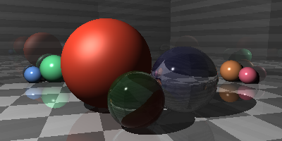
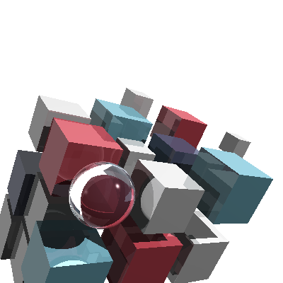
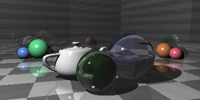

## Ray Tracer
This is an implementation of the [Ray Tracer Challenge](http://www.raytracerchallenge.com/) written in Rust.

Here are some example renders.

The first 2D and 3D images the ray tracer created.

Cubes and Only Cubes

Reflections and Refractions Scene

The Cover Image of the Book

Demonstration of OBJ File Rendering

## Status

This implementation supports the majority of features described in the book. There are rough edges to the API and several optimizations hinted at in the text have not yet been implemented.

- [x] Chapter 1 - Tuples, Points, and Vectors
- [x] Chapter 2 - Drawing on a Canvas
- [x] Chapter 3 - Matrices
- [x] Chapter 4 - Matrix Transformations
- [x] Chapter 5 - Ray-Sphere Intersections
- [x] Chapter 6 - Light and Shading
- [x] Chapter 7 - Making a Scene
- [x] Chapter 8 - Shadows
- [x] Chapter 9 - Planes
- [x] Chapter 10 - Patterns
- [x] Chapter 11 - Reflection and Refraction
- [x] Chapter 12 - Cubes
- [x] Chapter 13 - Cylinders
- [x] Chapter 14 - Groups
- [x] Chapter 15 - Triangles
- [x] Chapter 16 - Constructive Solid Geometry (CSG)
- [ ] Chapter 17 - Next Steps
- [x] A1 - Rendering the Cover Image
- [ ] B1 - [Rendering Soft Shadows](http://www.raytracerchallenge.com/bonus/area-light.html)
- [ ] B2 - [Bounding box and hierarchies](http://www.raytracerchallenge.com/bonus/bounding-boxes.html)
- [ ] B3 - [Texture Mapping](http://www.raytracerchallenge.com/bonus/texture-mapping.html)
- [x] Render [Shadow Puppets Scene Description](https://forum.raytracerchallenge.com/thread/2/shadow-puppets-scene-description)
- [x] Render [Table Scene Description](https://forum.raytracerchallenge.com/thread/6/tables-scene-description)
- [x] Render [Book Cover Scene Description](scenes/cover.yaml)

## Missing Features

These are features or images from the book missing in the implemention.
- [ ] Chapter 13 - Cones
- [ ] Ability to render [groups scene description](https://forum.raytracerchallenge.com/thread/13/groups-scene-description)
- [ ] Ability to render [cylinders scene description](https://forum.raytracerchallenge.com/thread/7/cylinders-scene-description)

## Possible Future Direction

- [ ] Compile to wasm
- [ ] Export directly to png
- [ ] Display renders line by line as they are computed

## Other Implementations

Here's a summary of other implementations I've found on the web. Some of them even provided inspiration for how I went about implementing certain features.

* [undo76](https://github.com/undo76/raytracer-rust) - this one supports bounding boxes and bound volume hierarchies
* [magnusstrale](https://github.com/magnusstrale/raytracer) - uses `as_any` to allow downcasting which is leveraged in the `PartialEq` implementation
* [fredrikln](https://github.com/fredrikln/the-raytracer-challenge) - I based my status checklist off of the readme in this project
* [tomafro](https://github.com/tomafro/ray-tracer-challenge) - looks to support up to spheres and planes
* [wtfleming](https://github.com/wtfleming/rust-ray-tracer) - this one has support for compiling to wasm