## Renders
Here is a list of renders made using the ray tracer. These trace the evolution of its capabilities.

Groups - This render required parsing of groups in the YAML Scene Descriptions along with the implementation of cones and inheriting default materials from an object's parent.

Fresnel Effect - This is a fun image of a glass sphere with an air bubble in its middle. Rendering this was just a matter of finding the scene description to run through the rendered. All the needed features had been implemented previously.

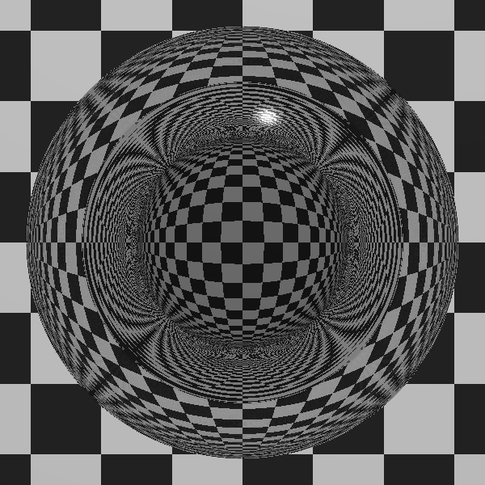

Cylinders - Rendering this required updating the YAML Scene Description parser to handle the cylinder shape. Everything else had been implemented previously.

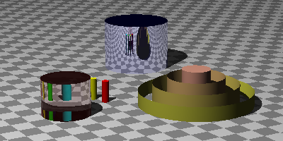

Shadow Puppets - This one initially didn't work. The YAML Scene Description parser used different parsing logic for each type of shape. That branch had not been updated to handle color. The fix was to abstract that logic out so all object types support the same set of properties.

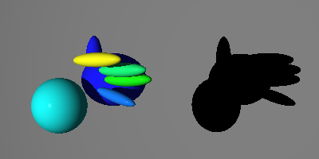

Book Cover - This render required fixing several problems. The scene descriptions contained materials that inherited from one another. Once this was implemented, the lighting code needed to be updated. Support for multiple lights had only partially been implemented. Fixing both of those led to an improvement in the surface colors on the cubes, improvements in the shadows cast by one of the lights, and the left side of the cubes being more well lit.

The remaining enigma is why the sphere is lighter than the one in the book.

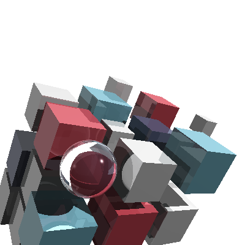

Book Cover Take One - To render this version required adding a support for several more abstractions in the scene description parser. When it was first done, I didn't realize how far off the the original picture it was. Note the dark left side of the cubes and the faint second shadow of the sphere on the left side of the adjacent gray cube.
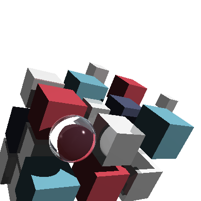

Book Cover Take One - Smaller Render

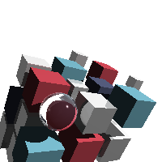

Book Cover Take One - Tiny Render

Reflections, Refractions, and Teapots... Oh, my! - This render took 2+ hours. The high poly count teapot really bogs down the render without other optimizations being implemented. This version was described in code instead of a scene description.

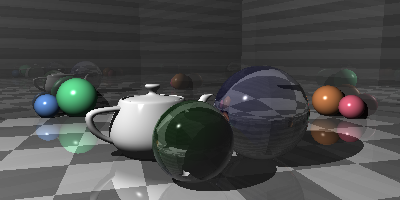

Smaller Version

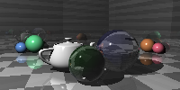

Teapots - Experiments with rendering a teapot and moving the camera slightly.

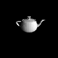

Groups - This is a rendering of a hexagon done following the instructions to wrap up the chapter on implementing support for groups. It has no color because I had not implemented the optional support for inheriting colors by this point.

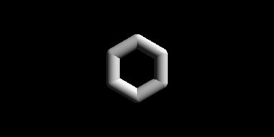

Reflections and Refractions - Getting this to work is when I finally felt like I was making some real progress! It is still one of my favorite renders. The scene was described in code, but was ported from the yaml scene description.

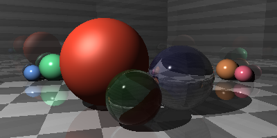

Acne - This was a moment of near dispair. The book describes this problem and what leads to it. There's even a nice picture. Between tracking down the one place I had used the wrong point variable and figuring out which order to chain the transformations, I was left wondering whether I hadn't seriously messed up my implementation.

Some careful isolation of the problems and experimentations made this but a momentary bump in the journey.

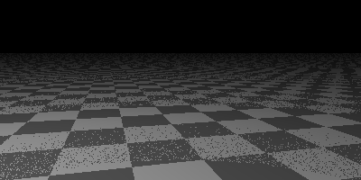

Patterns on Shapes - Example render done after patterns started applying to shapes instead of just to the world.

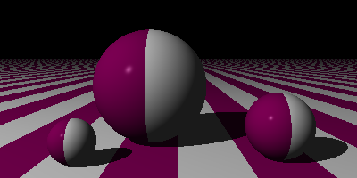

Patterns on Everything - Seeing a pattern applied to a scene was exciting, even if the patterns were just painted across everything.

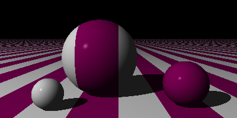

Patterns on a Plane - First step is applying patterns.

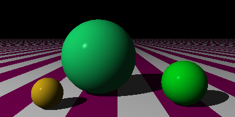

An Inifinite Plane - The first scenes were made up entirely of flattened spheres. Removing the walls allowed the infinite expanse to be seen for the first time.

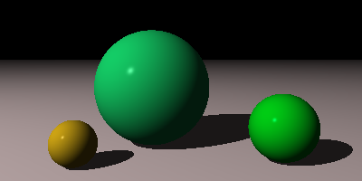

Shadows - They definitely add a nice touch to a scene.

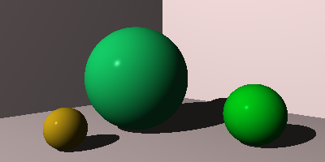

First Scene - See objects in a scene for the first time was really excited. Who cares if everything you see is a sphere of some sort or there are no shadows?

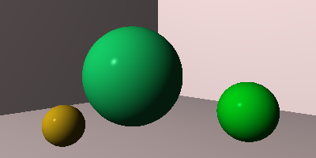

Big Sphere - Rendering larger versions is fun. Since the renderer doesn't implement anti-aliasing, the higher resolution helps to cut down on jagged edges.

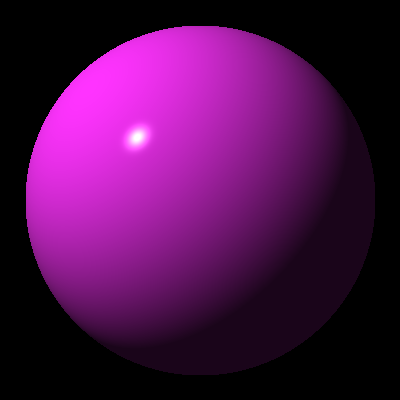

First Spheres - When the first sphere was rendered, I made a mistake in the logic that applied colors so the first sphere was without color.

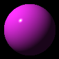
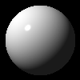

Circles - ... or should I say 2D outlines of a 3D sphere rendered by casting rays at it (after possibly squishing it)? Either way, yay!

Drawing in 2D - These, extremely hard to see images, were the result of applying some of the graphics and matrix primitives to display dots in a circle, mimicing the hour positions on a clock.

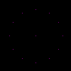
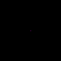

First Dots - These were some of the attempts done to draw dots on the newly created canvas object. The first visible (in a graphical sense) progress on the journey to rendering objects in 3D.

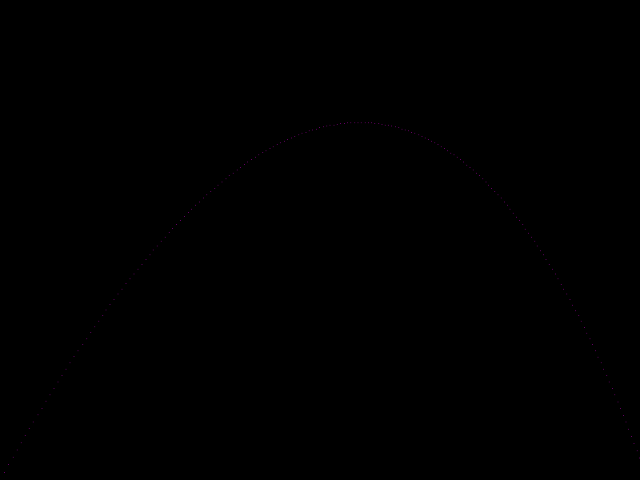
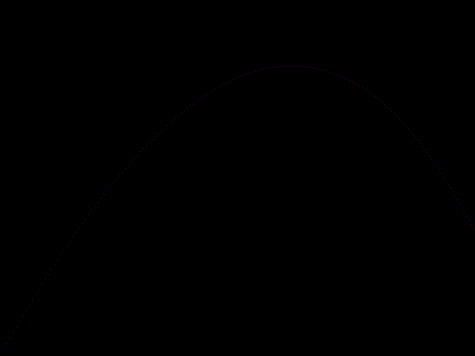
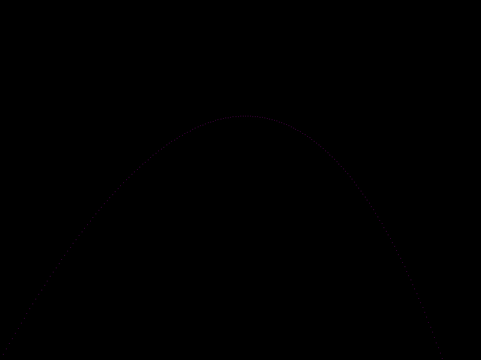
